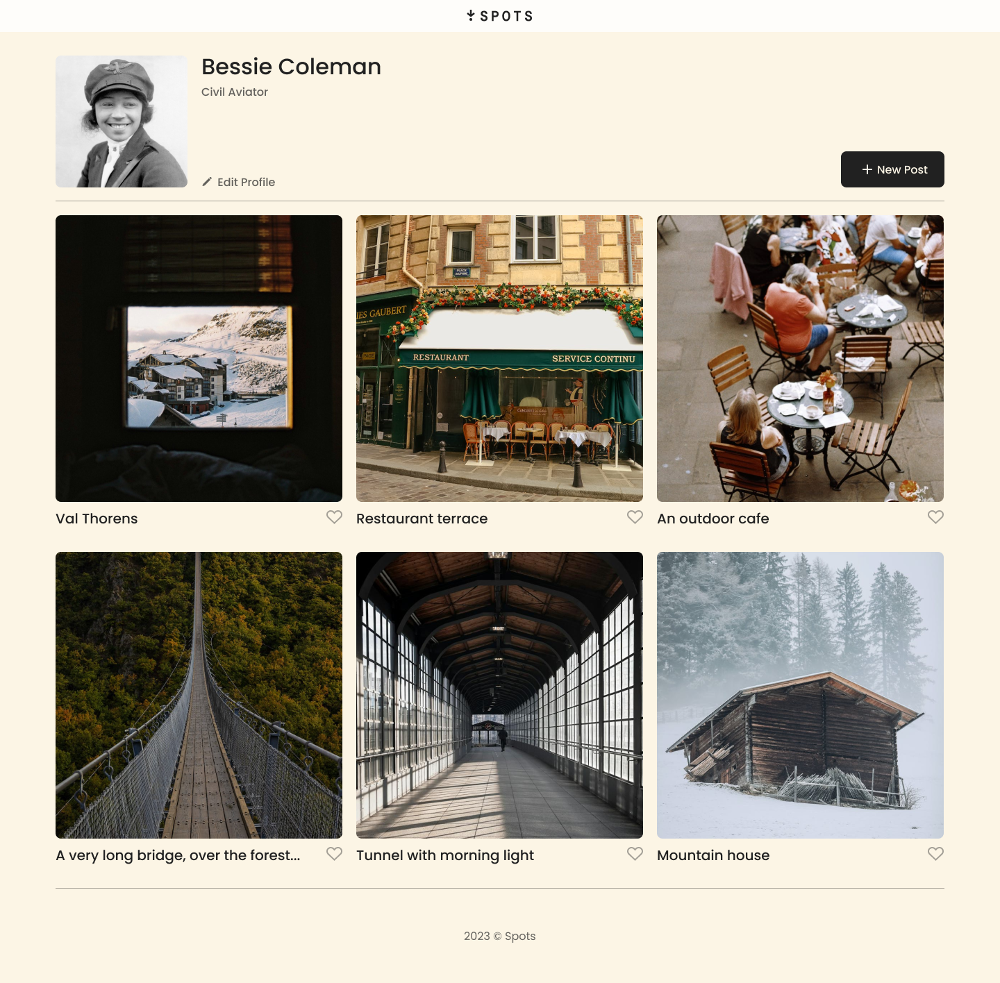
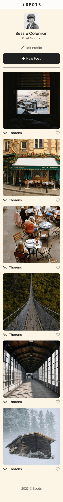

# Spots

A photo-sharing social media web app.

**Check out Spots** [here](https://ryanzomparelli.github.io/se_project_spots/)

**Watch a brief video overview** [here](https://drive.google.com/file/d/13w7uFwlzL-z5HIjMBbJHGKxwVurm0Lfc/view?usp=sharing)

## Overview

- Intro
- Figma
- Images

**Intro**

This project is made so all the elements are displayed correctly on popular screen sizes. Some of the project features are:

- Semantic HTML5
- Flexbox
- Grid
- Media queries
- Flat BEM file structure

**Figma**

- [Link to the project on Figma](https://www.figma.com/file/BBNm2bC3lj8QQMHlnqRsga/Sprint-3-Project-%E2%80%94-Spots?type=design&node-id=2%3A60&mode=design&t=afgNFybdorZO6cQo-1)

**Images**

1440px Resolution

Mobile view 320px resolution

