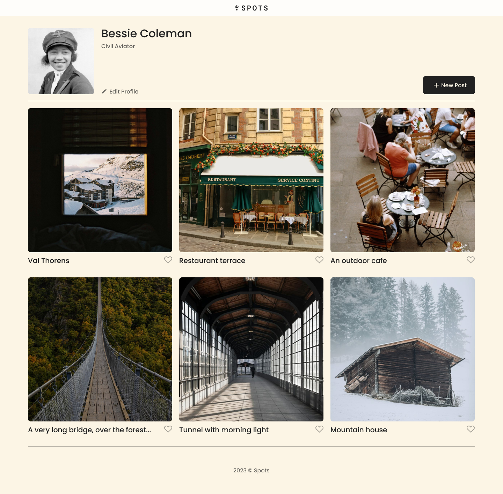
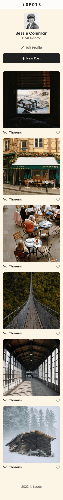
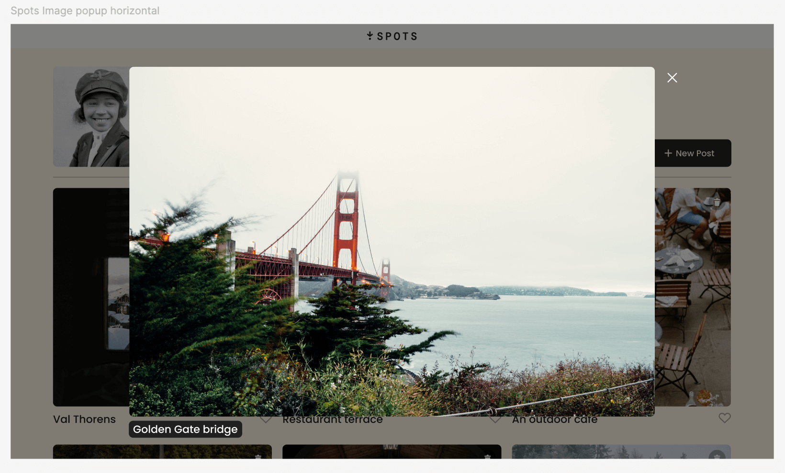
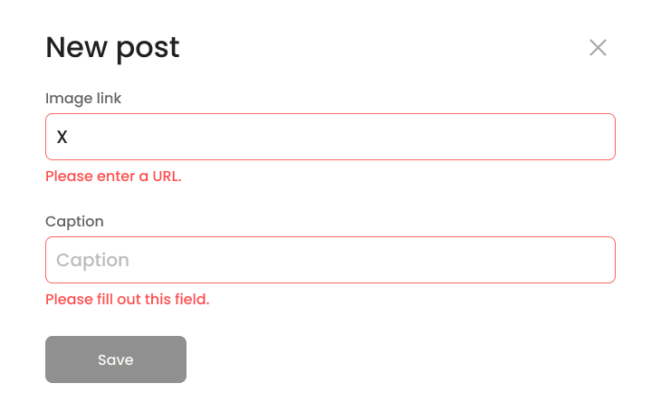
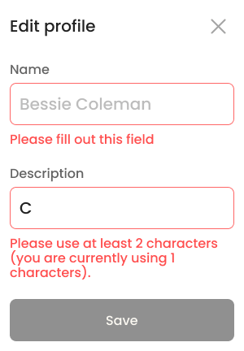

# Spots

Spots is a photo-sharing social media web app featuring responsive design, dynamic modals, form validation, and server integration via a custom API class.

**Check out Spots** [here](https://ryanzomparelli.github.io/se_project_spots/)

**Video presentation in less than 5 minutes** [here](https://www.loom.com/share/67fdc263fdad4a6c9333c0c874c6e111)

## Table of Contents

- [Overview](#overview)
- [Features](#features)
- [Figma Design](#figma-design)
- [Notes](#notes)
- [Validation System](#form-validation)
- [Screenshots](#screenshots)

## Overview

This app allows users to create, edit, and delete photo cards, update their profile and avatar, and interact with other users’ content, all backed by a server connection. Well... it’s just me for now, but user authentication is the next step!

## Features

- Fully responsive layout using Flexbox and Grid

- Modular JavaScript with object-oriented architecture

- Form validation with real-time error messages

- Persistent data via RESTful API (GET, POST, PATCH, PUT, DELETE)

- Interactive modals and preview popups

- Built and deployed with Webpack

## Figma Design

- [Link to the original project on Figma](https://www.figma.com/file/BBNm2bC3lj8QQMHlnqRsga/Sprint-3-Project-%E2%80%94-Spots?type=design&node-id=2%3A60&mode=design&t=afgNFybdorZO6cQo-1)

- [Preview modal design](https://www.figma.com/design/p7amENvGmugKHfrOif5p1E/Sprint-5-Project-Spots---March-2025?node-id=0-1&p=f&t=nvLNQfAvaHZdK2UN-0)

- [Form Validation](https://www.figma.com/design/jFtXsDr4XOyebKcgjyXN6W/Sprint-6-Project--Spots?node-id=4392-312&t=xtGjqIPVOXevyczR-0)

- [Latest Figma iteration](https://www.figma.com/design/mXGZ6wZ4QPKx5KjpHX9QCV/Sprint-9-Project--Spots?node-id=0-1&p=f&t=MvHig1y8jXzrCG6n-0)

## Notes

**Webpack**

Spots is bundled, built and deployed with webpack, using a series of loaders, plugins, and other dependencies all orchestrated using NPM!

**OOP**

While this project leverages JavaScript modules and includes a dedicated custom `Api` class, most of the logic still resides in `index.js`. In the future, I plan to refactor this file and break the logic into smaller, decoupled, and reusable classes. This would significantly improve readability, scalability, and long-term maintainability.

If you'd like to see a more fully modular and class-based implementation, check out my [Todo App repository](https://github.com/RyanZomparelli/se_project_todo-app), which better reflects the culmination of my current studies in object-oriented programming and modular design.

For now, all API interactions in Spots stem from methods of the `Api` class. This class is instantiated in `index.js` and used throughout the app in a series of asynchronous calls to manage UI interactions and persist data with the backend.

**API interactions**

Spots is now wired up to a backend server! I can now save and update my profile with a series of fetch API requests. The HTTP methods Im using to exchange data are:

-GET for initial page load

-POST to add new cards

-PATCH to update the user info and profile avatar

-PUT to add likes

-DELETE to remove likes and cards

## Form validation

The Spots application features dynamic form validation messages that update in real-time as users enter input.

This is achieved using the validationMessage property of form elements, which returns a browser-generated error message when an input is invalid. If the input is valid, it returns an empty string.

The validation message is dynamically assigned to the form field using a template literal that combines a unique id and class for each input element.

For Example:

```js
const inputError = formEl.querySelector(`.${inputEl.id}-error`);
```

Check out the validation.js file to see how I utilized a modular format with reusable functions for form validation. You can also experiment with the modals yourself by clicking the 'Spots' link at the top of the README.

## Screenshots

1440px Resolution



Mobile view 320px resolution



Preview modal popup



Modal window with dynamic from validation



Mobile view of modal with dynamic form validation



```

```
